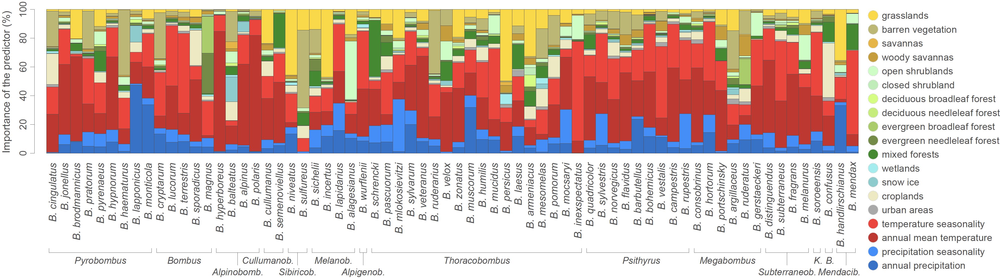

This repo gathers the input files and scripts related to our study entitled "**Wildlife conservation strategies should incorporate both taxon identity and geographical context - further evidence with bumblebees**" ([Ghisbain *et al*. 2020](https://onlinelibrary.wiley.com/doi/full/10.1111/ddi.13155), *Diversity & Distributions*). R scripts related to the analyses are all gathered within the file `Script_ENM_analyses.r`.

Abstract: Among the numerous anthropogenic pressures threatening biodiversity, habitat destruction and climate change are pointed to as dominant. In response, a number of mitigation strategies are elaborated to save endangered living organisms. However, the taxonomic level and geographical extent at which conservation strategies should be designed and implemented remain generally unclear. Here, we aim to assess and discuss the importance to apply conservation strategies at an appropriate taxonomic scale. For this purpose, we focus our analyses on bumblebees (genus Bombus), a group of critically important and endangered pollinators. We use a species distribution modelling approach to investigate and compare climatic and habitat-related variables associated with the distribution of West-Palaearctic bumblebees. Our analyses are based on a data set gathering more than 125,000 unique observation points for 68 species. We highlight species-specific associations with climatic and land cover variables, depicting the strong relevance of taxon-specific mitigation strategies for the conservation of those key pollinators. We also identify that the occurrence probability of localized and widespread species is mostly predicted by specific land cover characteristics and climatic conditions, respectively. Finally, we report the general absence of phylogenetic signal associated with the relative importance of each environmental variable in species distribution models, underlining the difficulty to predict species-specific environmental requirements based on evolutionary relationships. In the light of these results, we conclude that climate change and landscape destruction are not expected to drive the fate of all bumblebee species in a same direction, even for phylogenetically close lineages. We argue in favour of geographically and taxonomically adapted conservation strategies and discuss the limitations of untargeted action plans for species with different climatic/habitat requirements.

**Figure: mapped changes in ecological suitability for 46 European bumblebee species based on an observational data set of 401,046 unique georeferenced occurrence records.** Relative importance of each environmental variable as predictor in the different species distribution models. Species are here organised by subgenera following the classification of Williams *et al*. (2008). "*K.*" and "*B.*" refer to "*Kallobombus*" and "*Bombias**", respectively.
